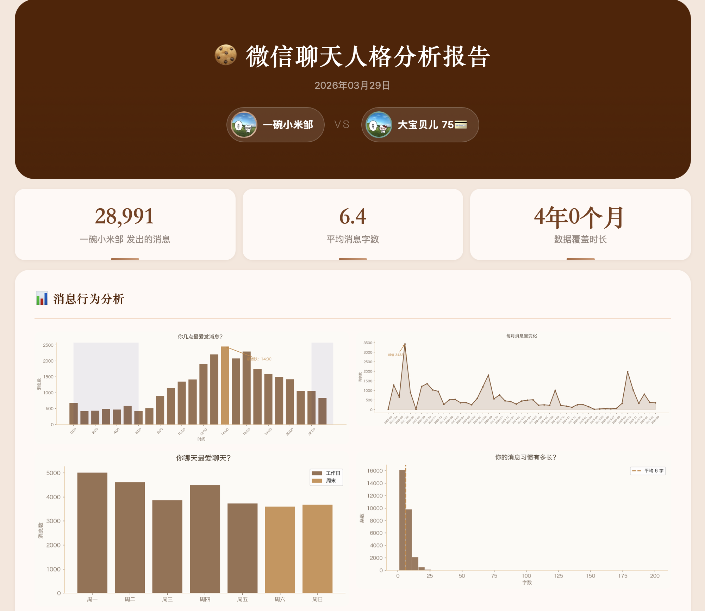
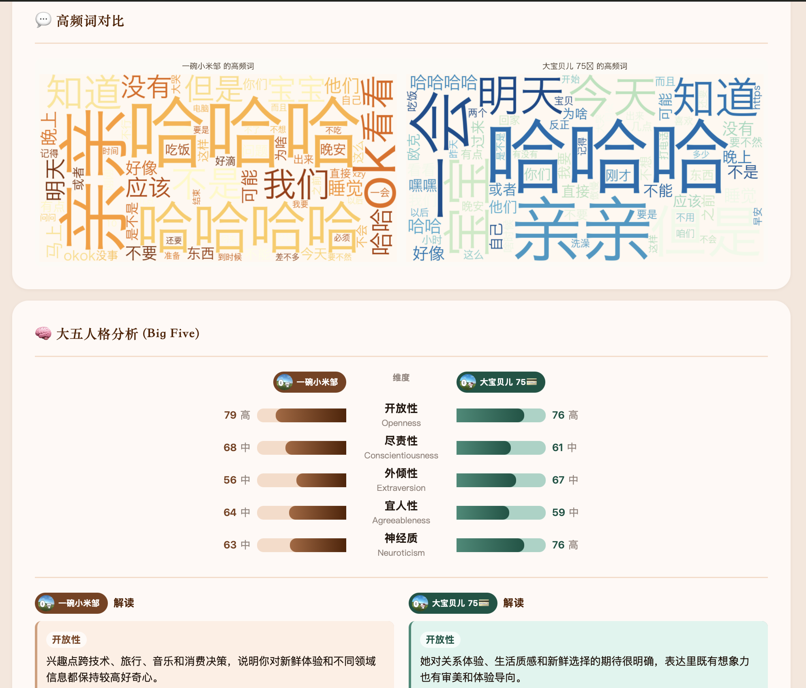
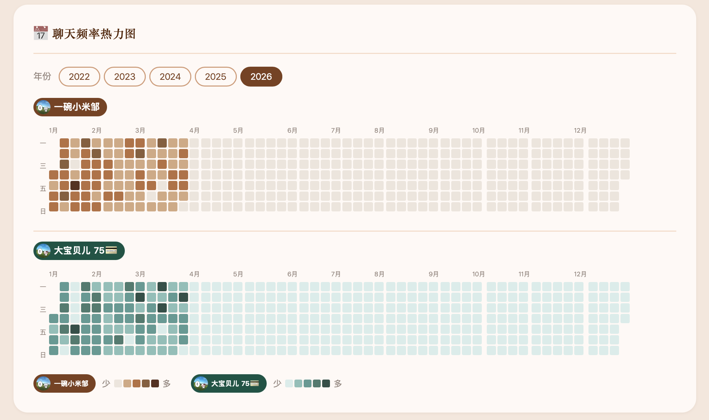
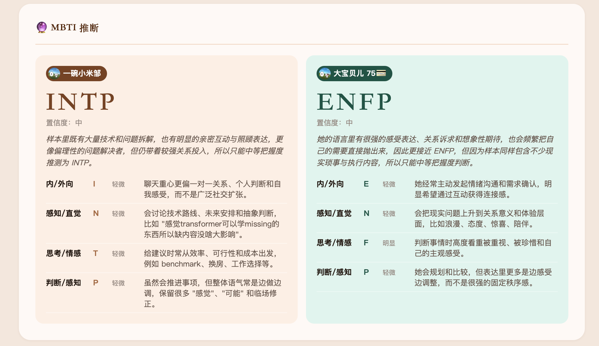
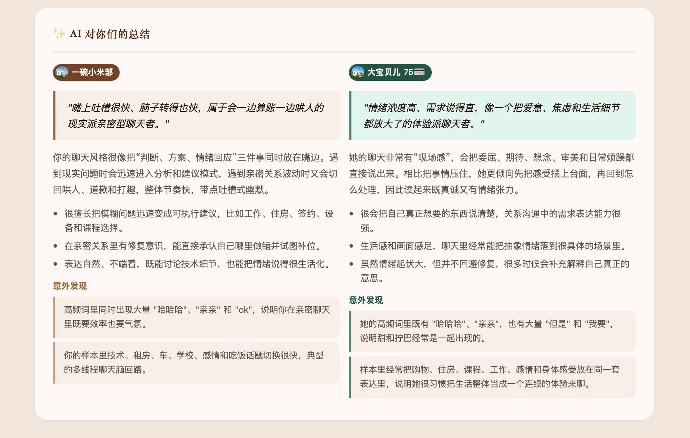

# 微信聊天记录分析工具 · Codex Fork

> 本仓库基于上游项目 [`Jiang59991/wechat-analyzer`](https://github.com/Jiang59991/wechat-analyzer) 的 fork 进行改造。  
> 原项目的整体思路、数据处理流程与初始实现归上游作者所有；本 fork 主要将原先依赖 Claude Code 的工作流，调整为可由 Codex 接管的人格分析与报告生成流程。

---

## 这个 fork 改了什么

- 移除了主流程对 `Anthropic / Claude` 的硬依赖
- 保留原有本地数据处理、图表生成、HTML 报告能力
- 新增 `codex_workflow.py`，提供 `prepare / validate / finalize` 三段式工作流
- 让人格分析步骤变成标准的 JSON 输入 / JSON 输出接口，方便由 Codex 接管
- 更新 README 与安装说明，改成面向 Codex 的使用方式

---

## 项目效果

<p align="center"></p>

<table>
<tr>
<td width="50%"></td>
<td width="50%"></td>
</tr>
</table>

<p align="center"></p>

<p align="center"></p>

---

## 使用要求

| 项目 | 要求 |
|------|------|
| 操作系统 | macOS 12 及以上 |
| 微信版本 | Mac 客户端 4.x |
| Python | 3.10 及以上 |
| Codex | 能读取工作区文件并写回 JSON 结果 |
| 机器内存 | 建议最低 16GB，推荐 24GB 及以上 |

你不需要 Claude Code，也不需要 Anthropic API Key。

### Codex 推荐设置

为了尽量给人格分析阶段保留完整上下文，建议把 Codex 的上下文相关配置设置为：

```toml
model_context_window = 1000000
model_auto_compact_token_limit = 900000
```

### 运行内存建议

- 建议最低运行内存为 16GB，推荐 24GB 起。
- 如果机器只有 8GB，建议先关闭无关的所有进程再运行。
- 在 8GB 机器上直接跑完整流程时，系统压力可能会过高，运行可能中断。

---

## Plugin 入口

这个仓库现在包含一个 repo-local Codex plugin：

- Plugin: `wechat-analyzer-codex`
- Skill: `analyze-wechat`

打开这个仓库后，如果 Codex 需要你手动启用本地插件，就在本仓库的 local repo plugins 中启用 `WeChat Analyzer for Codex`。  
启用后，你可以直接这样用：

```text
$analyze-wechat 帮我分析和小明的微信聊天记录
```

或者：

```text
使用 $analyze-wechat，继续我已经导出的 CSV 分析流程，并生成最终报告
```

如果你只是想看底层命令，后面的“Codex 工作流”章节也保留了 CLI 方式。

---

## 安装

### 方式一：项目内虚拟环境

```bash
git clone git@github.com:Tyreal-Izual/ginger_wechat_portrait.git
cd ginger_wechat_portrait

python3 -m venv .venv
source .venv/bin/activate
pip install -r requirements.txt
```

### 方式二：使用已有 conda 环境

如果你已经有可用的本地环境，比如 `general`：

```bash
conda activate general
pip install -r requirements.txt
```

---

## 一次性前置步骤

和上游项目一样，首次读取微信数据库时仍然需要两步手工操作：

1. 关闭 SIP
2. 在系统 `Terminal.app` 里手动运行内存扫描版密钥提取脚本

这部分限制来自 macOS 调试权限，不是 Claude 或 Codex 特有问题。  
详细说明见 [安装指南.md](./安装指南.md)。

---

## Codex 工作流

推荐优先使用 plugin/skill 入口：

```text
$analyze-wechat 帮我分析和小明的微信聊天记录
```

skill 会按当前仓库的流程去做：

1. 检查环境与本地数据库是否就绪
2. 导出联系人消息
3. 生成人格分析输入
4. 由 Codex 写出结果 JSON
5. 生成最终 HTML 报告

如果你需要手动调试、分步执行，下面是等价的 CLI 流程。

整个 CLI 流程可以理解成三步：

1. 准备输入：导出聊天记录、生成图表与人格分析输入 JSON
2. 让 Codex 读取输入 JSON，写出 `personality_result.json`
3. 读取结果 JSON，生成最终 HTML 报告

### 第一步：导出联系人消息

在完成数据库解密与 `config.json` 配置后，先导出某个联系人的聊天记录：

```bash
python export_contact.py --contact "联系人备注或昵称"
```

脚本会输出：

- `EXPORT_PATH:...`
- `META_PATH:...`

其中 `EXPORT_PATH` 对应后续要传给工作流的 CSV 文件。

---

### 第二步：生成 Codex 输入

```bash
python codex_workflow.py prepare ./export_xxx.csv
```

这一步会生成：

- `wechat_analysis_output/personality_input.json`
- `wechat_analysis_output/partner_input.json`（如果存在对方可用样本）
- `wechat_analysis_output/codex_analysis_prompt.md`
- 所有图表资源

其中 `codex_analysis_prompt.md` 是给 Codex 直接执行的提示文件，里面已经写好了：

- 要读取哪些 JSON
- 结果要写到哪里
- 必须遵循什么 schema
- 下一步 finalize 命令是什么

---

### 第三步：让 Codex 生成结果 JSON

在 Codex 中打开这个仓库后，可以直接让它读取 prompt 文件，例如：

```text
请读取 wechat_analysis_output/codex_analysis_prompt.md，按照里面的要求生成人格分析结果 JSON，并在写完后继续执行 finalize 命令生成最终报告。
```

Codex 需要写出的文件通常是：

- `wechat_analysis_output/personality_result.json`
- `wechat_analysis_output/partner_result.json`（若存在对方输入）

如果你想先单独检查 JSON 是否符合 schema，可以运行：

```bash
python codex_workflow.py validate ./wechat_analysis_output/personality_result.json
```

---

### 第四步：生成最终报告

如果你没有让 Codex 自动执行最后一步，也可以手动运行：

```bash
python codex_workflow.py finalize ./export_xxx.csv \
  --self-result ./wechat_analysis_output/personality_result.json \
  --partner-result ./wechat_analysis_output/partner_result.json
```

若没有对方结果，省略 `--partner-result` 即可。

---

## 输出文件

默认输出目录为 `./wechat_analysis_output/`：

```text
wechat_analysis_output/
├── report.html
├── report.css
├── personality_input.json
├── partner_input.json
├── personality_result.json
├── partner_result.json
├── personality_raw.json
├── codex_analysis_prompt.md
└── charts/
    ├── hourly.png
    ├── monthly_trend.png
    ├── weekday_bar.png
    ├── word_cloud_pair.png
    ├── word_cloud.png
    ├── length_dist.png
    └── radar.png
```

---

## 适合 Codex 接管的地方

这个 fork 的核心思路是把人格分析阶段改造成稳定接口：

- 输入：`personality_input.json` / `partner_input.json`
- 输出：`personality_result.json` / `partner_result.json`

因此 Codex 只需要负责中间这一段“读 JSON -> 写 JSON”，而数据导出、统计分析、图表生成、HTML 报告仍由现有 Python 脚本完成。

---

## 主要脚本

```text
codex_workflow.py   Codex 版 prepare / validate / finalize 入口
main.py             生成分析输入，或读取结果 JSON 生成最终报告
export_contact.py   从解密后的微信数据库导出联系人消息
features.py         提取语言特征
personality.py      生成 Codex 提示词并校验结果 JSON
report.py           生成 HTML 报告
visualizer.py       生成图表
```

---

## 隐私说明

- 所有数据处理在本地完成
- 不需要把聊天内容发送到外部 API 才能完成项目主流程
- 请仅分析你自己设备上的数据

---

## 上游归属

本仓库是上游项目的改造 fork，不是从零开始重写的新项目。  
如果你在公开介绍、二次发布或继续 fork 本仓库，建议保留对上游仓库和原作者的明确引用。
